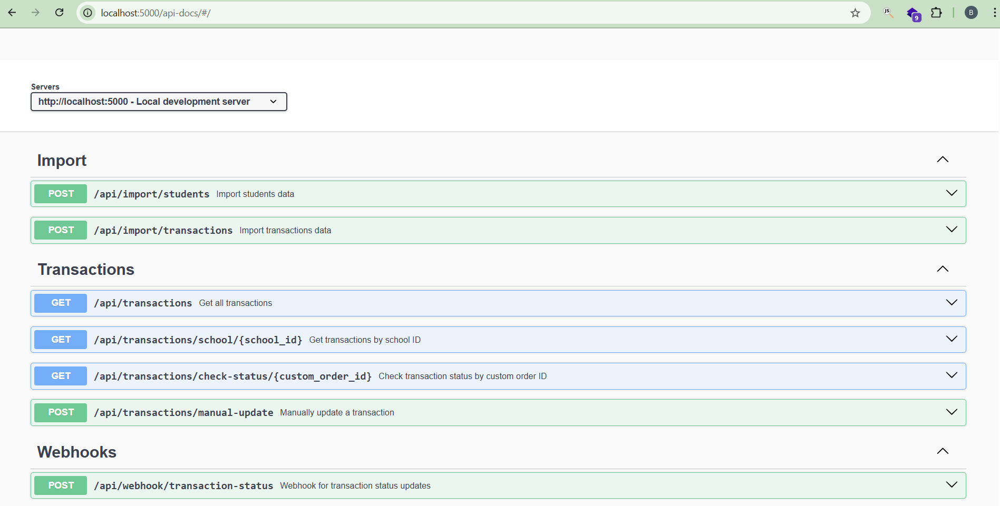
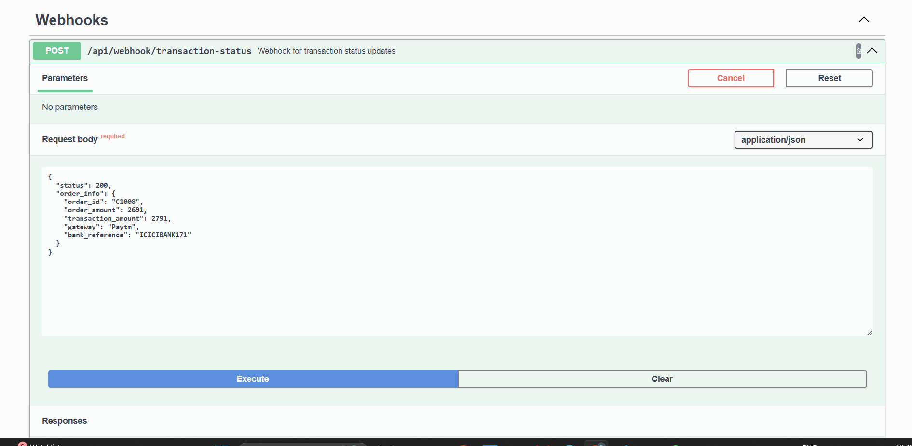
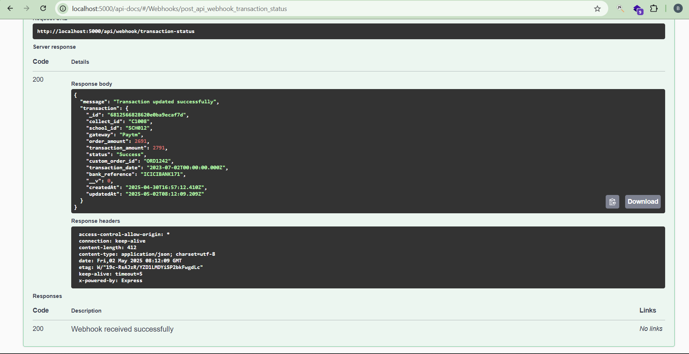
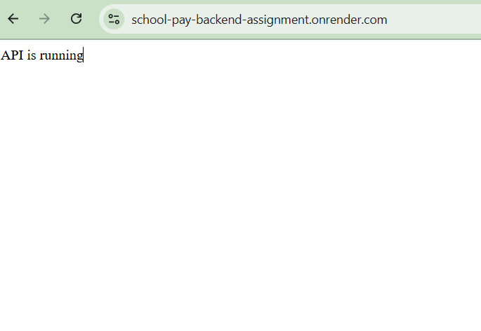
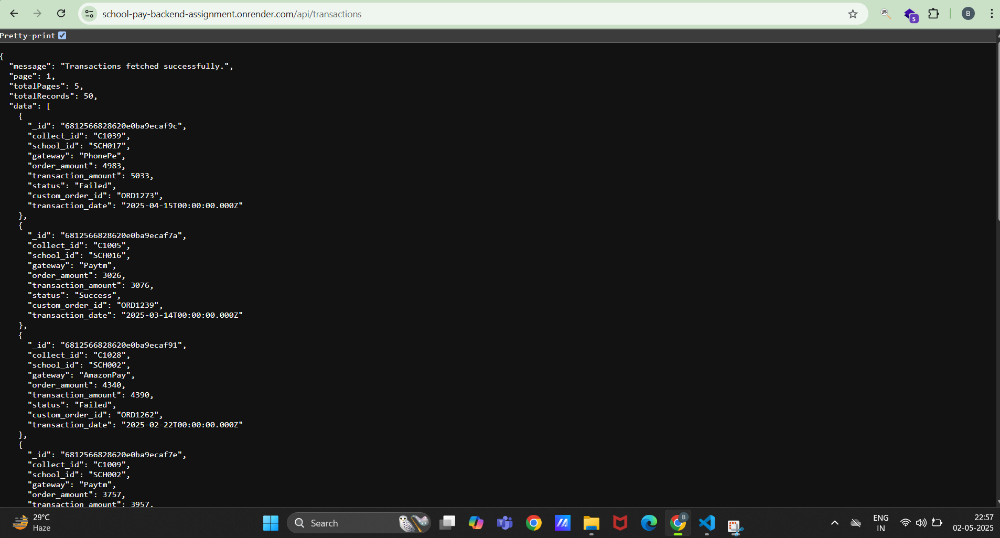

# School Payments & Dashboard API

## Swagger Screenshots

### Swagger API's


### Webhook API


### Webhook API Response


### Live Backend URL


### Live Backend URL Data



This repository contains the backend API's for the School Payments & Dashboard application, built with Node.js, Express, and MongoDB.

## 🔧 Tech Stack

- **Node.js** - JavaScript runtime
- **Express.js** - Web framework
- **MongoDB** - NoSQL database
- **Mongoose** - MongoDB ODM
- **Swagger/OpenAPI** - API documentation
- **CSV Parser** - For importing data from CSV files
- **dotenv** - Environment variable management

## 📋 Features

- RESTful API endpoints for managing school transactions
- MongoDB integration with Mongoose models and validation
- Data import functionality from CSV/Excel files with 3-year random date generation
- Comprehensive API documentation using Swagger UI
- Webhook handling for transaction status updates
- Pagination and filtering capabilities with date range support
- Environment variable configuration
- ES6+ JavaScript syntax with modern patterns
- Robust error handling with appropriate HTTP status codes
- MVC architecture with separation of concerns
- Industry-standard security practices
- Request payload validation with Mongoose schemas
- CSV parsing and processing capabilities
- Swagger API documentation with interactive testing features

## 🚀 Getting Started

### Prerequisites

- Node.js (v14 or higher)
- MongoDB (local or MongoDB Atlas)
- npm or yarn package manager
- Git

### Installation

1. Clone the repository

   ```bash
   git clone https://github.com/kantamanenibharathsai/schoolPayBackendAssignment.git
   cd schoolPayBackendAssignment
   ```

2. Install dependencies

   ```bash
   npm install

   ```

3. Create a `config.env` file in the root directory with the following variables:

   ```
   PORT=5000
   MONGODB_URI=mongodb://localhost:27017/school-payments
   NODE_ENV=development

   ```

4. Import sample data (optional)

   ```bash
   npm run import-data

   ```

## Usage

### Development Mode

To start the server in development mode with automatic reloading:

```bash
npm run dev

```

### Production Mode

For production deployment:

```bash
npm start

```

The server will be running at `http://localhost:5000` (or the PORT specified in your config.env file)

Live API: [https://school-pay-backend-assignment.onrender.com](https://school-pay-backend-assignment.onrender.com/)

### Environment Variables

| Variable           | Description                               | Default                                   |
| ------------------ | ----------------------------------------- | ----------------------------------------- |
| PORT               | Port to run the server on                 | 5000                                      |
| MONGODB_URI        | MongoDB connection string                 | mongodb://localhost:27017/school-payments |
| NODE_ENV           | Application environment                   | development                               |

## 📁 Project Structure

```
school-payments-backend/
├── controllers/          # Request handlers following REST principles
│   ├── importController.js
│   └── transactionController.js
├── data/                 # Data files (CSV/Excel)
├── dbconfig/             # Database configuration
│   └── db.js             # MongoDB connection
├── models/               # Mongoose models with validation
│   ├── student.js
│   └── transaction.js
├── node_modules/         # Node.js dependencies
├── routes/               # API routes organized by resource
│   ├── importRoutes.js
│   └── transactionRoutes.js
├── services/             # Business logic layer
│   ├── importService.js
│   └── transactionService.js
├── swagger/              # API documentation
│   └── swagger.js
├── utils/                # Helper functions and utilities
│ 
│   ├── csvParser.js      # CSV parsing utility
│   ├── errorHandler.js   # Custom error classes
│
├── app.js                # Express application setup
├── config.env            # Environment variables
├── package-lock.json
├── package.json
├── README.md
└── server.js             # Server entry point with unhandled rejection handling
```

## 🔄 API Endpoints

### Transactions

| Method | Endpoint                                          | Description                            | Status Codes | Request Validation |
| ------ | ------------------------------------------------- | -------------------------------------- | ------------ | ------------------ |
| GET    | `/api/transactions`                               | Get all transactions with pagination, start_date, end_date | 200, 400, 500 | Query params validation for date format, pagination params |
| GET    | `/api/transactions/school/:school_id`             | Get transactions for a specific school, start_date, end_date | 200, 404, 500 | Path param validation for school_id, query params for dates |
| GET    | `/api/transactions/check-status/:custom_order_id` | Check transaction status               | 200, 404, 500 | Path param validation for custom_order_id |
| POST   | `/api/transactions/manual-update`                 | Manually update transaction status     | 200, 400, 404, 500 | Body validation for status, custom_order_id |

### Webhooks

| Method | Endpoint                          | Description                           | Status Codes | Request Validation |
| ------ | --------------------------------- | ------------------------------------- | ------------ | ------------------ |
| POST   | `/api/webhook/transaction-status` | Update transaction status via webhook | 200, 400, 404, 500 | Body validation for transaction details |

### Import Data

| Method | Endpoint                | Description                    | Status Codes | Request Validation |
| ------ | ----------------------- | ------------------------------ | ------------ | ------------------ |
| POST   | `/api/import/students`  | Import students from CSV file  | 201, 400, 500 | File validation for CSV format, headers, and data types |
| POST   | `/api/import/transactions` | Import transactions from CSV file | 201, 400, 500 | File validation for CSV format, headers, and data types |

## 📚 API Documentation

API documentation is available through Swagger UI at `/api-docs` when the server is running.

### Accessing Swagger Documentation

1. Start the server using `npm run dev` or `npm start`
2. Navigate to `http://localhost:5000/api-docs` in your browser
3. Explore and test API endpoints directly from the Swagger UI interface

### Response Format

All API responses follow a consistent JSON format:

**Success Response:**
```json
{
  "success": true,
  "data": {
    // Response data here
  },
  "message": "Operation completed successfully"
}
```

**Error Response:**
```json
{
  "success": false,
  "error": {
    "code": "ERROR_CODE",
    "message": "Error description"
  }
}
```

### Student Model
```javascript
{
  student_id: String,  // required, unique
  name: String,        // required
  school_id: String,   // required
  class: String,       // required
  email: String,       // required
  phone: String,       // required
  address: String,
  createdAt: Date,     // automatically added by timestamps
  updatedAt: Date      // automatically added by timestamps
}
```

### Transaction Model
```javascript
{
  collect_id: String,      // required, unique
  school_id: String,       // required
  gateway: String,
  order_amount: Number,
  transaction_amount: Number,
  status: String,          // enum: ['Success', 'Pending', 'Failed'], default: 'Pending'
  custom_order_id: String, // required, unique
  transaction_date: Date,  // default: Date.now
  bank_reference: String,
  createdAt: Date,         // automatically added by timestamps
  updatedAt: Date          // automatically added by timestamps
}
```

## 📄 Data Import

The application includes functionality to import data from CSV files:

- Place your students.csv and transactions.csv files in the data directory
- Access the import endpoint or use the import controller functionality:
  - POST `/api/import/students`
  - POST `/api/import/transactions`

### CSV Format Requirements

#### Students CSV Format:
```
student_id,name,school_id,class,email,phone,address
ST001,John Doe,SCH123,Class 10A,john@example.com,1234567890,123 Main St
ST002,Jane Smith,SCH123,Class 10B,jane@example.com,9876543210,456 Oak Ave
```

#### Transactions CSV Format:
```
collect_id,school_id,gateway,order_amount,transaction_amount,status,custom_order_id,transaction_date,bank_reference
COLL001,SCH123,PayU,1000,950,Success,ORD001,2023-01-15,REF123456
COLL002,SCH123,Razorpay,1500,1450,Pending,ORD002,2023-01-16,REF789012
```

### Transaction Date Generation

The system automatically generates random transaction dates spanning the last 3 years when importing transaction data. This provides realistic historical data for reporting and analytics purposes, allowing users to:

- View transaction trends over time
- Generate monthly and yearly reports
- Analyze seasonal payment patterns
- Compare year-over-year performance

### Import Process

1. The CSV file is uploaded or read from the data directory
2. Each row is validated against the corresponding Mongoose schema
3. For transactions, random dates within the last 3 years are assigned if not provided
4. Valid data is transformed and inserted into the database
5. Failed rows are collected and returned in the response
6. A summary report is generated showing successful and failed imports

The application uses a custom CSV parser utility to parse the CSV files and populate the MongoDB database with the data.

## 🧪 Testing

Run tests using:

```bash
npm test
```

## 🛠️ Development Standards

### Request Validation

The application implements comprehensive request validation:

- **Mongoose Schema Validation**: All request payloads are validated using Mongoose schemas
- **Express Middleware**: Custom validation middleware applied to routes
- **Model-level Validation**: Data validation at the database model level
- **Error Messaging**: Clear error messages for validation failures

### Sample Mongoose Validation Schema (Transaction):
```javascript
const transactionSchema = new mongoose.Schema({
  collect_id: { 
    type: String, 
    required: [true, 'Collect ID is required'], 
    unique: true 
  },
  school_id: { 
    type: String, 
    required: [true, 'School ID is required'] 
  },
  gateway: String,
  order_amount: { 
    type: Number, 
    min: [0, 'Order amount cannot be negative'] 
  },
  transaction_amount: { 
    type: Number, 
    min: [0, 'Transaction amount cannot be negative'] 
  },
  status: { 
    type: String, 
    enum: ['Success', 'Pending', 'Failed'], 
    default: 'Pending' 
  },
  custom_order_id: { 
    type: String, 
    required: [true, 'Custom order ID is required'], 
    unique: true 
  },
  transaction_date: { 
    type: Date, 
    default: Date.now 
  },
  bank_reference: String
}, { timestamps: true });
```

### CSV Parser Implementation

The application includes a custom CSV parser utility built with Express and native Node.js capabilities:

- **Stream Processing**: Efficient handling of large CSV files using Node.js streams
- **Date Generation**: Automatic generation of random transaction dates spanning 3 years
- **Custom Mapping**: Maps CSV columns to MongoDB fields
- **Validation**: Uses Mongoose schemas to validate CSV data before database insertion
- **Error Handling**: Detailed error reporting for invalid CSV data
- **Transaction Support**: Atomic database operations for consistent data

### REST API Principles

This API follows standard REST principles:
- **Resource-based URLs**: Clearly defined endpoints for each resource
- **Proper HTTP methods**: GET for retrieval, POST for creation, PUT/PATCH for updates, DELETE for removal
- **Stateless communication**: No client state stored on the server
- **Standard status codes**: Appropriate HTTP status codes for responses (200, 201, 400, 401, 403, 404, 500)
- **JSON response format**: Consistent response structure

### Project Architecture

- **MVC Pattern**: Clear separation between Models, Controllers, and Views (API responses)
- **Service Layer**: Business logic abstracted into service files
- **Middleware**: Custom middleware for authentication, error handling, and request processing
- **Route Modularization**: Routes organized by resource type for maintainability

### Code Quality Standards

- **ES6+ Syntax**: Modern JavaScript features (arrow functions, destructuring, async/await, etc.)
- **Promises/Async-Await**: Asynchronous code handling without callback hell
- **Consistent Error Handling**: Centralized error handling middleware
- **Input Validation**: Request validation before processing

### Error Handling
The application implements a robust error handling system:
- **Custom Error Classes**: Extended Error classes for different types of errors
- **Error Middleware**: Centralized error processing
- **Appropriate Status Codes**:
  - `200` - Success
  - `201` - Resource created
  - `400` - Bad request
  - `401` - Unauthorized
  - `403` - Forbidden
  - `404` - Resource not found
  - `422` - Validation error
  - `500` - Server error
- **Descriptive Error Messages**: User-friendly error responses

## 🚀 Deployment

The API is deployed at: [https://school-pay-backend-assignment.onrender.com/api/](https://school-pay-backend-assignment.onrender.com/api/)

## 🔒 Security Features

- **Data Validation**: Strict validation of all input data
- **Environment Variables**: Sensitive information stored in environment variables
- **Error Handling**: Generic error messages in production to avoid information leakage

## 🚀 Performance Optimizations

- **Database Indexing**: Optimized MongoDB queries with proper indexing
- **Query Optimization**: Efficient database queries
- **Compression**: Response compression for faster data transfer
- **Pagination**: Limiting result sets for better performance
- **Caching**: Implementation of response caching where appropriate

## 📝 License

This project is licensed under the MIT License - see the LICENSE file for details.

## 👥 Contributors

- Kantamaneni Bharath Sai - [GitHub](https://github.com/kantamanenibharathsai/school-pay-backend-assignment)
